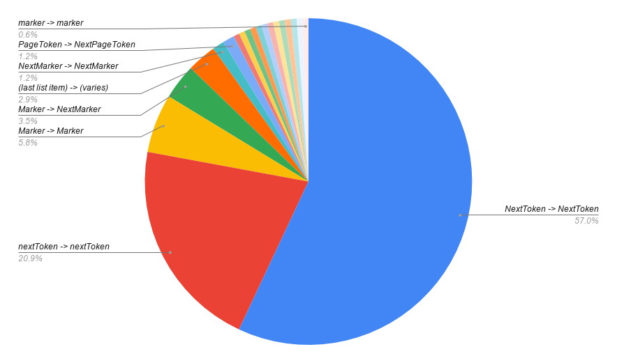

# AWS Pagination Rules

## JS SDK

Service | Request Key | Response Key
--- | --- | ---
ACM | NextToken | NextToken
ACMPCA | NextToken | NextToken
AlexaForBusiness | NextToken | NextToken
Amplify | nextToken | nextToken
APIGateway | position | position
ApiGatewayManagementApi | N/A | N/A
ApiGatewayV2 | NextToken | NextToken
ApplicationAutoScaling | NextToken | NextToken
ApplicationInsights | NextToken | NextToken
AppMesh | nextToken | nextToken
AppStream | NextToken | NextToken
AppSync | nextToken | nextToken
Athena | NextToken | NextToken
AutoScaling | NextToken | NextToken
AutoScalingPlans | NextToken | NextToken
Backup | NextToken | NextToken
Batch | nextToken | nextToken
Budgets | NextToken | NextToken
Chime | NextToken | NextToken
Cloud9 | nextToken | nextToken
CloudDirectory | NextToken | NextToken
CloudFormation | NextToken | NextToken
CloudFront | Marker | _dict[0]_.NextMarker
CloudHSM | NextToken | NextToken
CloudHSMV2 | NextToken | NextToken
CloudSearch | N/A | N/A
CloudSearchDomain | N/A | N/A
CloudTrail | NextToken | NextToken
CloudWatch | NextToken | NextToken
CloudWatchEvents | NextToken | NextToken
CloudWatchLogs | nextToken | nextToken
CodeBuild | nextToken | nextToken
CodeCommit | nextToken | nextToken
CodeDeploy | nextToken | nextToken
CodePipeline | nextToken | nextToken
CodeStar | nextToken | nextToken
CognitoIdentity | NextToken | NextToken
CognitoIdentityServiceProvider | NextToken | NextToken
CognitoSync | NextToken | NextToken
Comprehend | NextToken | NextToken
ComprehendMedical | NextToken | NextToken
ConfigService | nextToken | nextToken
Connect | NextToken | NextToken
CostExplorer | NextPageToken | NextPageToken
CUR | NextToken | NextToken
DataPipeline | marker | marker
DataSync | NextToken | NextToken
DAX | NextToken | NextToken
DeviceFarm | nextToken | nextToken
DirectConnect | nextToken | nextToken
DirectoryService | NextToken | NextToken
Discovery | nextToken | nextToken
DLM | N/A | N/A
DMS | Marker | Marker
DocDB | Marker | Marker
DynamoDB | _uses last item_ | _uses last item_
DynamoDBStreams | _uses last item_ | _uses last item_
EC2 | NextToken | NextToken
EC2InstanceConnect | N/A | N/A
ECR | nextToken | nextToken
ECS | nextToken | nextToken
EFS | Marker | NextMarker
EKS | nextToken | nextToken
ElastiCache | Marker | Marker
ElasticBeanstalk | NextToken | NextToken
ElasticTranscoder | PageToken | NextPageToken
ELB | Marker | NextMarker
ELBv2 | Marker | NextMarker
EMR | Marker | Marker
ES | NextToken | NextToken
EventBridge | NextToken | NextToken
Firehose | _uses last item_ | _uses last item_
FMS | NextToken | NextToken
ForecastQueryService | NextToken | NextToken
ForecastService | NextToken | NextToken
FSx | NextToken | NextToken
GameLift | NextToken | NextToken
Glacier | marker | Marker
GlobalAccelerator | NextToken | NextToken
Glue | NextToken | NextToken
Greengrass | NextToken | NextToken
GroundStation | nextToken | nextToken
GuardDuty | NextToken | NextToken
Health | nextToken | nextToken
IAM | Marker | Marker
ImportExport | Marker | _uses last item_
Inspector | nextToken | nextToken
Iot | marker | nextMarker
IoT1ClickDevicesService | NextToken | NextToken
IoT1ClickProjects | nextToken | nextToken
IoTAnalytics | nextToken | nextToken
IotData | N/A | N/A
IoTEvents | nextToken | nextToken
IoTEventsData | nextToken | nextToken
IoTJobsDataPlane | N/A | N/A
IoTThingsGraph | nextToken | nextToken
Kafka | NextToken | NextToken
Kinesis | _uses last item_ | _uses last item_
KinesisAnalytics | _uses last item_ | _uses last item_
KinesisAnalyticsV2 | NextToken | NextToken
KinesisVideo | NextToken | NextToken
KinesisVideoArchivedMedia | NextToken | NextToken
KinesisVideoMedia | N/A | N/A
KMS | Marker | NextMarker
LakeFormation | NextToken | NextToken
Lambda | Marker | NextMarker
LexModelBuildingService | nextToken | nextToken
LexRuntime | N/A | N/A
LicenseManager | NextToken | NextToken
Lightsail | pageToken | nextPageToken
MachineLearning | NextToken | NextToken
Macie | nextToken | nextToken
ManagedBlockchain | NextToken | NextToken
MarketplaceCommerceAnalytics | N/A | N/A
MarketplaceEntitlementService | NextToken | NextToken
MarketplaceMetering | N/A | N/A
MediaConnect | NextToken | NextToken
MediaConvert | NextToken | NextToken
MediaLive | NextToken | NextToken
MediaPackage | NextToken | NextToken
MediaPackageVod | NextToken | NextToken
MediaStore | NextToken | NextToken
MediaStoreData | NextToken | NextToken
MediaTailor | NextToken | NextToken
MigrationHub | NextToken | NextToken
Mobile | nextToken | nextToken
MobileAnalytics | N/A | N/A
MQ | NextToken | NextToken
MTurk | NextToken | NextToken
Neptune | Marker | Marker
OpsWorks | NextToken | NextToken
OpsWorksCM | NextToken | NextToken
Organizations | NextToken | NextToken
Personalize | nextToken | nextToken
PersonalizeEvents | N/A | N/A
PersonalizeRuntime | N/A | N/A
PI | NextToken | NextToken
Pinpoint | Token | _dict[0]_.NextToken
PinpointEmail | NextToken | NextToken
PinpointSMSVoice | NextToken | NextToken
Polly | NextToken | NextToken
Pricing | NextToken | NextToken
QLDB | NextToken | NextToken
QLDBSession | N/A | N/A
QuickSight | NextToken | NextToken
RAM | nextToken | nextToken
RDS | Marker | Marker
RDSDataService | N/A | N/A
Redshift | Marker | Marker
Rekognition | NextToken | NextToken
ResourceGroups | NextToken | NextToken
ResourceGroupsTaggingAPI | PaginationToken | PaginationToken
RoboMaker | nextToken | nextToken
Route53 | Marker | NextMarker
Route53Domains | Marker | NextPageMarker
Route53Resolver | NextToken | NextToken
S3 | ContinuationToken _or_ Marker ** | NextContinuationToken _or_ NextMarker **
S3Control | NextToken | NextToken
SageMaker | NextToken | NextToken
SageMakerRuntime | N/A | N/A
SecretsManager | NextToken | NextToken
SecurityHub | NextToken | NextToken
ServerlessApplicationRepository | NextToken | NextToken
ServiceCatalog | PageToken | NextPageToken
ServiceDiscovery | NextToken | NextToken
ServiceQuotas | NextToken | NextToken
SES | NextToken | NextToken
Shield | NextToken | NextToken
Signer | nextToken | nextToken
SimpleDB | NextToken | NextToken
SMS | nextToken | nextToken
Snowball | NextToken | NextToken
SNS | NextToken | NextToken
SQS | N/A | N/A
SSM | NextToken | NextToken
StepFunctions | nextToken | nextToken
StorageGateway | Marker | Marker
STS | N/A | N/A
Support | nextToken | nextToken
SWF | nextPageToken | nextPageToken
Textract | NextToken | NextToken
TranscribeService | NextToken | NextToken
Transfer | NextToken | NextToken
Translate | NextToken | NextToken
WAF | NextMarker | NextMarker
WAFRegional | NextMarker | NextMarker
WorkDocs | Marker | Marker
WorkLink | NextToken | NextToken
WorkMail | NextToken | NextToken
WorkMailMessageFlow | N/A | N/A
WorkSpaces | NextToken | NextToken
XRay | NextToken | NextToken
